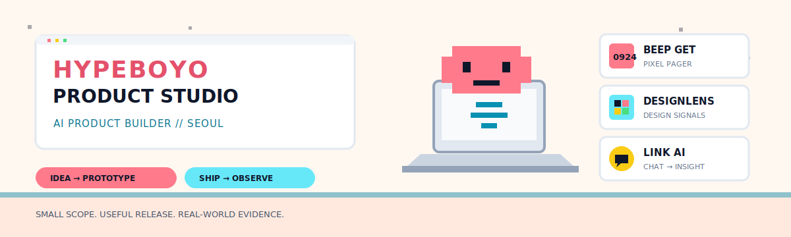

<picture>
  <source media="(prefers-color-scheme: dark) and (max-width: 480px)" srcset="./assets/hypeboyo-studio-mobile-dark.svg" />
  <source media="(prefers-color-scheme: light) and (max-width: 480px)" srcset="./assets/hypeboyo-studio-mobile-light.svg" />
  <source media="(prefers-color-scheme: dark)" srcset="./assets/hypeboyo-studio-dark.svg" />
  <source media="(prefers-color-scheme: light)" srcset="./assets/hypeboyo-studio-light.svg" />
  
</picture>

<div align="center">

# Hypeboyo

**AI Product Builder · one-person studio in Seoul**

작은 아이디어를 작고 쓸모 있는 AI 제품으로 만듭니다.<br />
I turn focused ideas into working consumer products—from prototype to production-ready build.

[Try DesignLens](https://designlens-alpha.vercel.app) · [Selected work](#selected-work) · [Open-source lab](#labs--open-source)

</div>

## Selected work

### 01 · [Beep Get](https://github.com/slimex200-wq/beep-get) · Mobile app

A cozy pixel pager for sharing small feelings through numeric codes and a home-screen widget.

`React Native` `TypeScript` `Expo` · [Repository](https://github.com/slimex200-wq/beep-get)

---

### 02 · [DesignLens](https://github.com/slimex200-wq/designlens) · Live web product

Turns visual references into colors, typography, layout patterns, UI feedback, and exportable design tokens.

`Next.js` `TypeScript` `AI vision` · [Open live product ↗](https://designlens-alpha.vercel.app) · [Repository](https://github.com/slimex200-wq/designlens)

---

### 03 · [KakaoTalk Link Analyzer](https://github.com/slimex200-wq/katalk-link-analyzer) · Open-source tool

Extracts, crawls, summarizes, classifies, searches, and exports links from exported KakaoTalk chats.

`Python` `FastAPI` `SQLite` · [Repository](https://github.com/slimex200-wq/katalk-link-analyzer)

## Shipping system

```text
01  Find one focused problem
02  Build the smallest useful version
03  Ship a working artifact
04  Observe real-world evidence and iterate
```

Small scope over feature sprawl. Working product over polished promise. Evidence over vanity metrics.

## Labs & open source

- **[refable](https://github.com/slimex200-wq/refable)** — an MIT-licensed, [`fablize`](https://github.com/fivetaku/fablize)-derived Claude Code plugin that adds KO/EN routing, directed propagation, delegation economy, and adapted workflow gates.
- **[ai-threads](https://github.com/slimex200-wq/ai-threads)** — a publishing pipeline that collects AI news and turns it into Threads-ready posts.

<details>
<summary><strong>Toolbelt</strong></summary>

`TypeScript` · `Python` · `React Native` · `Next.js` · `Claude` · `OpenAI`

</details>

## Build activity

<div align="center">

<picture>
  <source media="(prefers-color-scheme: dark)" srcset="https://raw.githubusercontent.com/slimex200-wq/slimex200-wq/output/github-contribution-grid-snake-dark.svg" />
  <source media="(prefers-color-scheme: light)" srcset="https://raw.githubusercontent.com/slimex200-wq/slimex200-wq/output/github-contribution-grid-snake.svg" />
  
</picture>

<sub><code>[ HBY-200 ] SIGNAL RECEIVED FROM SEOUL · BUILD SMALL / SHIP REAL</code></sub>

</div>
